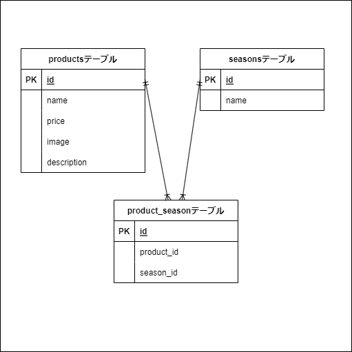

# mogitate

## 環境構築
- Dockerのビルドからマイグレーション、シーディングまでを記述する
ディレクトリに、20240509_fleamarcket.gitをクローン
```
git clone git@github.com:Fujita-Hi/mogitate.git
```
dockerで環境を構築
```
docker-compose up -d --build
```
パッケージをインストール
```
docker-compose exec php bash
```
PHPコンテナ上で実行
```
composer install
php artisan key:generate
```

ターミナル上でsrc配下に移動し.envを.env.exampleを下に作成し環境変数を変更  
```
cd src/
cp .env.example .env
```

PHPコンテナ上でテーブルとダミーデータの作成
```
php artisan migrate
php artisan db:seed
```


## 使用技術(実行環境)
* Laravel 10.48.13
* PHP 8.2.12
* MySQL 8.0.26

## ER図


## URL
* 開発環境：http://localhost/
* phpMyAdmin:http://localhost:8080/